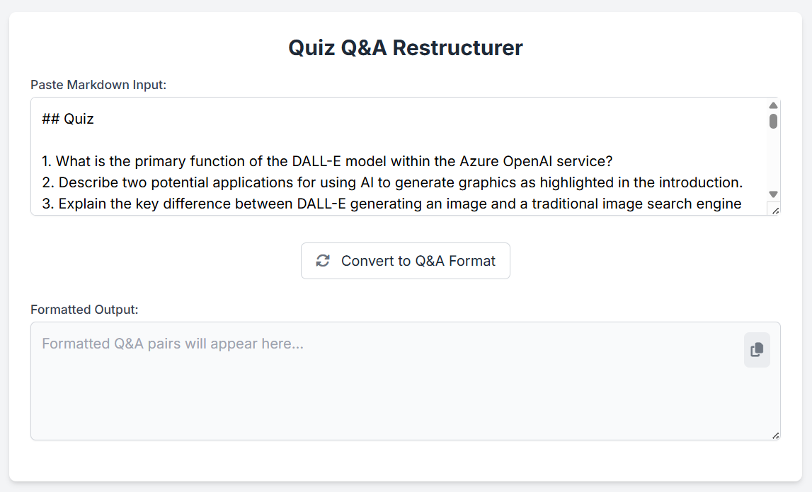

# Quiz Q&A Restructurer

A simple, elegant web tool that helps restructure quiz questions and answers from a standard markdown format into a paired Q&A format.



## Overview

This lightweight web application takes quiz content in a specific markdown format and reorganizes it into a paired question-and-answer format that's easier to study from.

### Features

- **Simple Markdown Input**: Accepts quiz content with questions and answers in separate sections
- **Automatic Reformatting**: Intelligently pairs questions with their corresponding answers
- **Multi-line Answer Support**: Properly handles multiple paragraphs in answers
- **Minimalist UI**: Clean, distraction-free interface with subtle visual feedback
- **Clipboard Support**: One-click copying of formatted results

## How to Use

1. Open `index.html` in any modern web browser
2. Paste your markdown-formatted quiz content into the input box
3. Click "Convert to Q&A Format"
4. The restructured Q&A content will appear in the output box
5. Use the copy button to copy the results to your clipboard

## Input Format Requirements

The tool expects markdown content in this specific format:

```markdown
## Quiz

1. First question?
2. Second question?
...

## Quiz Answer Key

1. Answer to first question.
2. Answer to second question.
...
```

## Output Format

The tool will generate output in this format:

```
Question 1: First question?
Answer:
Answer to first question.

Question 2: Second question?
Answer:
Answer to second question.
```

## Browser Compatibility

- Chrome (recommended)
- Firefox
- Safari
- Edge

## Technologies Used

- HTML5
- JavaScript (ES6+)
- Tailwind CSS for styling
- Font Awesome for icons

## License

MIT

---

Created with ❤️ to make studying easier
